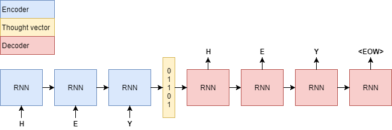

# Neural Language Translation with seq2seq Models - Codealong

## Introduction

So far, we have looked at building simple  and deep AEs for data compression and de-noising. We also looked at how CNN based AE architectures can produce improved results for compression and de-noising tasks in image analysis.

In this lab, we will look at how to implement a basic character-level sequence-to-sequence model using RNNs, following a similar encoder-decoder approach. The model will be able to translate short English phrases into short French, in a character-by-character fashion. Such a model can be further modified to process whole words instead of characters. You are encouraged to consider this experiment as a baseline model which you can further scale and modify according to an analytical question or a specific business need. 

## Objectives

You will be able to:

- Understand and describe a sequence to sequence architecture for language modeling 
- Pre-process a given text corpus to be trained under a teacher forcing approach
- Build a simple yet scalable machine translation deep seq2seq model using LSTMs

## Sequence to Sequence (seq2seq) Models 

The sequence to sequence (seq2seq) model is a deep learning model that converts an input sequence into an output sequence. In this context, the sequence could be a list of symbols, corresponding to the words in a sentence. The seq2seq model has achieved great success in fields such as machine translation, chat bots and text summarization. All of these tasks can be regarded as the task to learn a model that converts an input sequence into an output sequence.

### Model Architecture

The architecture of seq2seq model can be separated to the five major roles.

- Encoder Input Layer (Embedding)
- Encoder Recurrent Layer
- Decoder Input Layer (Embedding)
- Decoder Recurrent Layer
- Decoder Output Layer

Below is a highly simplified representation of this approach where we try to compress the input data and reproduce it as a standard function of an AE. 



[Follow this link](http://docs.chainer.org/en/stable/examples/seq2seq.html) to see a detailed version of this model describing the role of every component and maths behind the processing that takes place at each stage. Here we will briefly look at the role of each of above components.


### Encoder Model and the "Thought Vector"
Above we see that the encoder model is supplied with input "HEY".  For a character level model, we first split the complete sentence down to its character level. So first "H" is fed into the network and an intermediate state vector (known as a **Thought Vector** , shown in yellow) is formed containing the learned information of "H". **The thought vector is used for remembering key features of our input data as a standard function of an encoder**. Followed by this, the thought vector is fed into the second RNN input and it combines the information seen thus far (i.e. "H") with the new data ("E"). Finally, "Y" is added to the thought vector. The procedure so far is done by a so-called encoder. It takes characters (or other items) as input and it forms a thought vector as output.

> **“Thought vector”** is a term popularized by Geoffrey Hinton, the prominent deep-learning researcher now at Google. It is a very interesting topic and you can optionally [follow this link](https://skymind.ai/wiki/thought-vectors) to read an article for a detailed understanding with wider applications of thought vectors.

### Decoder Model 

In a simple seq2seq approach, the decoder model inputs the thought vector and produces an output. Based on the business need, We can train our seq2seq model for a number of possible applications. We can buils a chatbot using such an architecture model but by using words instead of characters. We can also train such a network for language translation. Other variants of such modeling can also offer features like image captioning, generating new images from text etc. 

The key strength  for this architecture is that the decoder is able to convert some numbers back to a text. This allows to generate some text in response to some given text. If the thought vector is small enough, then all input data is compressed into a small vector which contains just enough information. As an AE, The model also acts as a compressor as it learns how to store information as efficient as possible into the thought vector and how to decode the compression into text. 

## Machine Translation 

Next, we will look at using a seq2seq model , similar to the one shown above to create a machine translation architecture. 

> **Machine translation, sometimes referred to by the abbreviation MT is a sub-field of computational linguistics that investigates the use of software to translate text or speech from one language to another.**

A trained model would take an input string in english language and attempt to translate it into French, similar to example shown below

### "the cat sat on the mat" -> `[Seq2Seq model] ` -> "le chat etait assis sur le tapis"

View [this paper](https://arxiv.org/pdf/1703.01619.pdf) for a deep dive into neural machine translation with seq2seq approach. 

## Dataset

For this lab, we will use a dataset of pairs of English sentences and their French translation, which you can download from [Anki](http://manythings.org/anki). This site contains translations in a number of other languages and you are welcome to down a different dataset. The file we are using is `fra-eng.zip`. We will implement a character-level sequence-to-sequence model, processing the input character-by-character and generating the output character-by-character. 

We will perform following tasks to get our text data ready for processing in the first stage. 

- Read the dataset line by line and split to separate input (English) from target (French translation)
- For first 10000 entries: 
    - Create Input and Target dataset containing corresponding text 
    - Create character level vocabularies for both input and target datasets


```python
import numpy as np
# Read the input file - line by line 
with open('fra.txt', 'r', encoding='utf-8') as f:
    lines = f.read().split('\n')

# Vectorize the data.
input_texts = []
target_texts = []

# Target characters set
input_characters = set()
target_characters = set()

# Define number of samples to train on (you can increase or decrease this number as desired)
num_samples = 10000  

for line in lines[: min(num_samples, len(lines) - 1)]:
    
    # Read input and target - separated by "tab" 
    input_text, target_text = line.split('\t')
    
    # "tab" as the "start sequence" character for the targets, 
    # "\n" as "end sequence" character.
    target_text = '\t' + target_text + '\n'
   
    # Append input and target text to vectors
    input_texts.append(input_text)
    target_texts.append(target_text)
    
    # Create input and target, characater level sets
    for char in input_text:
        if char not in input_characters:
            input_characters.add(char)
    for char in target_text:
        if char not in target_characters:
            target_characters.add(char)
```

We can now sort the input and target character sets and check for length of our character level vocabularies comprised of characters as tokens. We will also check for the maximum length of sequence for input and target datasets to later define the architecture of our seq2seq model. 


```python
# Sort input and target character level vocabularies
input_characters = sorted(list(input_characters))
target_characters = sorted(list(target_characters))

# Calculate the length of vocabularies
num_encoder_tokens = len(input_characters)
num_decoder_tokens = len(target_characters)

# Identify sequences of maximum length for both encoder and decoder models
max_encoder_seq_length = max([len(txt) for txt in input_texts])
max_decoder_seq_length = max([len(txt) for txt in target_texts])

# Print the calculated information in a nice manner
print('Number of samples:', len(input_texts))
print('Number of unique input tokens:', num_encoder_tokens)
print('Number of unique output tokens:', num_decoder_tokens)
print('Max sequence length for inputs:', max_encoder_seq_length)
print('Max sequence length for outputs:', max_decoder_seq_length)

```

    Number of samples: 10000
    Number of unique input tokens: 69
    Number of unique output tokens: 93
    Max sequence length for inputs: 16
    Max sequence length for outputs: 59


Let's quickly see what our vocabularies look like below:


```python
# Print sorted character lists
print (input_characters)
print()
print (target_characters)
```

    [' ', '!', '$', '%', '&', "'", ',', '-', '.', '0', '1', '3', '5', '6', '7', '8', '9', ':', '?', 'A', 'B', 'C', 'D', 'E', 'F', 'G', 'H', 'I', 'J', 'K', 'L', 'M', 'N', 'O', 'P', 'Q', 'R', 'S', 'T', 'U', 'V', 'W', 'Y', 'a', 'b', 'c', 'd', 'e', 'f', 'g', 'h', 'i', 'j', 'k', 'l', 'm', 'n', 'o', 'p', 'q', 'r', 's', 't', 'u', 'v', 'w', 'x', 'y', 'z']
    
    ['\t', '\n', ' ', '!', '$', '%', '&', "'", '(', ')', ',', '-', '.', '0', '1', '3', '5', '8', '9', ':', '?', 'A', 'B', 'C', 'D', 'E', 'F', 'G', 'H', 'I', 'J', 'K', 'L', 'M', 'N', 'O', 'P', 'Q', 'R', 'S', 'T', 'U', 'V', 'Y', 'a', 'b', 'c', 'd', 'e', 'f', 'g', 'h', 'i', 'j', 'k', 'l', 'm', 'n', 'o', 'p', 'q', 'r', 's', 't', 'u', 'v', 'w', 'x', 'y', 'z', '\xa0', '«', '»', 'À', 'Ç', 'É', 'Ê', 'à', 'â', 'ç', 'è', 'é', 'ê', 'ë', 'î', 'ï', 'ô', 'ù', 'û', 'œ', '\u2009', '’', '\u202f']


Great! We have successfully created the vocabularies including uppercase/lowercase characters and punctuation marks present in both datasets.


### Creating Embeddings and Target 

We will now create 3 Numpy arrays:
- `encoder_input_data` 
- `decoder_input_data` 
- `decoder_target_data` 

using the input and target texts datasets created above. 

- `encoder_input_data` is a 3D array of shape `(num_pairs, max_english_sentence_length, num_english_characters)` containing a one-hot vectorization of the English sentences.

- `decoder_input_data` is a 3D array of shape `(num_pairs, max_french_sentence_length, num_french_characters)` containg a one-hot vectorization of the French sentences.

- `decoder_target_data` is the same as `decoder_input_data` but offset by one timestep. `decoder_target_data[:, t, :]` will be the same as `decoder_input_data[:, t + 1, :]` using the teacher forcing model. 


```python
# Create indices for input and target character level datasets
input_token_index = dict([(char, i) for i, char in enumerate(input_characters)])
target_token_index = dict([(char, i) for i, char in enumerate(target_characters)])

encoder_input_data = np.zeros((len(input_texts), 
                               max_encoder_seq_length, 
                               num_encoder_tokens), 
                              dtype='float32')

decoder_input_data = np.zeros((len(input_texts), 
                               max_decoder_seq_length, 
                               num_decoder_tokens),
                              dtype='float32')

decoder_target_data = np.zeros((len(input_texts), 
                                max_decoder_seq_length, 
                                num_decoder_tokens),
                               dtype='float32')

```

Great, the lengths of our vocabularies and total samples are now exactly was needed. This takes cares of our preprocessing stage. Let's move on to the modeling stage next. 

## Modeling Encoder and Decoder Architectures

### Building Encoder/Decoder with Teacher Forcing
- Start with input sequences (word or character level) from a domain (English) and corresponding target sequences from another domain (French).

- Use LSTM for encoder, turning input sequences to 2 state vectors (i.e. keep the last LSTM state, discarding the outputs).

- Following a "Teacher Forcing" approach (visit link below for details), use LSTM for decoder and trained it to turn the target sequences into the same sequence but offset by one timestep (i.e. on character) in the future. 

> Effectively, the decoder learns to generate `targets[t+1...]` given `targets[...t]`, conditioned on the input sequence.Here is a excellent resource explaining [Techer Forcing]([Teacher Forcing](https://machinelearningmastery.com/teacher-forcing-for-recurrent-neural-networks/) in detail. 


```python
# Create data offset for Teacher forcing model 
for i, (input_text, target_text) in enumerate(zip(input_texts, target_texts)):
    
    for t, char in enumerate(input_text):
        encoder_input_data[i, t, input_token_index[char]] = 1.
    
    for t, char in enumerate(target_text):
        # decoder_target_data is ahead of decoder_input_data by one timestep
        decoder_input_data[i, t, target_token_index[char]] = 1.
        
        if t > 0:
            # decoder_target_data will be ahead by one timestep and will not include the start character.
            decoder_target_data[i, t - 1, target_token_index[char]] = 1.

```

### Build the seq2seq Model

With our pre-processed dataset, we will perform following tasks to achieve the functionality highlighted above. 

- Train a basic LSTM-based Seq2Seq model to predict `decoder_target_data` given `encoder_input_data` and `decoder_input_data` using teacher forcing.
- Define an input sequence in keras using `num_encoder_tokens` for input shape
- Discard encoder outputs and only keep the LSTM state.
- Set up the decoder, using encoder state from above as initial state.
- Set up the decoder to return full output sequences,and to return internal states as well. 


```python
# Import necessary libraries - keras
from keras.models import Model
from keras.layers import Input, LSTM, Dense

latent_dim = 256  # Latent dimensionality of the encoding space.
```


```python
# Encoder LSTM

# Define an input sequence and process it.
encoder_inputs = Input(shape=(None, num_encoder_tokens))
encoder = LSTM(latent_dim, return_state=True)
encoder_outputs, state_h, state_c = encoder(encoder_inputs)

# Discard `encoder_outputs` and only keep the states.
encoder_states = [state_h, state_c]
```


```python
# Decoder LSTM

# Set up the decoder, using `encoder_states` as initial state.
decoder_inputs = Input(shape=(None, num_decoder_tokens))
decoder_lstm = LSTM(latent_dim, return_sequences=True, return_state=True)
decoder_outputs, _, _ = decoder_lstm(decoder_inputs,initial_state=encoder_states)

decoder_dense = Dense(num_decoder_tokens, activation='softmax')
decoder_outputs = decoder_dense(decoder_outputs)
```

### Train the Seq2Seq model
Now we can put together our encoder-decoder architecture by defining a model that will change `encoder_input_data` & `decoder_input_data` into `decoder_target_data`. As we a finite dictionary, we will use `categorical_crossentropy` as our loss measure. We will use `rmsprop` optimization that is a standard measure for such categorical data. We will train the model for 50 epochs (this will take a while to train) with a train/test split of 80/20. 

*We can optionally save the trained model as shown below. If you are not interested in running the complete training process, we have already trained this network and saved it for you. You can simply reload the saved model `eng-french.h5` available in the repo and carry on with rest of this lab. [Here is a quick reference for saving and retrieving models in Keras](https://jovianlin.io/saving-loading-keras-models/).*


```python
# Train the Model 

batch_size = 64  # Batch size for training.
epochs = 50  # Number of epochs to train for.
latent_dim = 256  # Latent dimensionality of the encoding space.

# Define the model 
model = Model([encoder_inputs, decoder_inputs], decoder_outputs)

# Run training
model.compile(optimizer='rmsprop', loss='categorical_crossentropy')

model.fit([encoder_input_data, decoder_input_data], 
          decoder_target_data,
          batch_size=batch_size,
          epochs=epochs,
          validation_split=0.2)

# Save model
model.save('eng-french.h5')
```

    Train on 8000 samples, validate on 2000 samples
    Epoch 1/50
    8000/8000 [==============================] - 32s 4ms/step - loss: 0.9193 - val_loss: 0.9500
    Epoch 2/50
    8000/8000 [==============================] - 31s 4ms/step - loss: 0.7296 - val_loss: 0.7711
    Epoch 3/50
    8000/8000 [==============================] - 30s 4ms/step - loss: 0.6193 - val_loss: 0.6979
    Epoch 4/50
    8000/8000 [==============================] - 30s 4ms/step - loss: 0.5626 - val_loss: 0.6374
    Epoch 5/50
    8000/8000 [==============================] - 31s 4ms/step - loss: 0.5210 - val_loss: 0.6019
    Epoch 6/50
    8000/8000 [==============================] - 31s 4ms/step - loss: 0.4893 - val_loss: 0.5763
    Epoch 7/50
    8000/8000 [==============================] - 28s 4ms/step - loss: 0.4630 - val_loss: 0.5494
    Epoch 8/50
    8000/8000 [==============================] - 29s 4ms/step - loss: 0.4416 - val_loss: 0.5355
    Epoch 9/50
    8000/8000 [==============================] - 35s 4ms/step - loss: 0.4225 - val_loss: 0.5171
    Epoch 10/50
    8000/8000 [==============================] - 28s 4ms/step - loss: 0.4051 - val_loss: 0.5034
    Epoch 11/50
    8000/8000 [==============================] - 30s 4ms/step - loss: 0.3888 - val_loss: 0.4942
    Epoch 12/50
    8000/8000 [==============================] - 28s 3ms/step - loss: 0.3745 - val_loss: 0.4896
    Epoch 13/50
    8000/8000 [==============================] - 27s 3ms/step - loss: 0.3601 - val_loss: 0.4770
    Epoch 14/50
    8000/8000 [==============================] - 29s 4ms/step - loss: 0.3471 - val_loss: 0.4703
    Epoch 15/50
    8000/8000 [==============================] - 32s 4ms/step - loss: 0.3349 - val_loss: 0.4615
    Epoch 16/50
    8000/8000 [==============================] - 31s 4ms/step - loss: 0.3234 - val_loss: 0.4597
    Epoch 17/50
    8000/8000 [==============================] - 32s 4ms/step - loss: 0.3123 - val_loss: 0.4562
    Epoch 18/50
    8000/8000 [==============================] - 31s 4ms/step - loss: 0.3023 - val_loss: 0.4565
    Epoch 19/50
    8000/8000 [==============================] - 33s 4ms/step - loss: 0.2925 - val_loss: 0.4521
    Epoch 20/50
    8000/8000 [==============================] - 32s 4ms/step - loss: 0.2828 - val_loss: 0.4495
    Epoch 21/50
    8000/8000 [==============================] - 31s 4ms/step - loss: 0.2738 - val_loss: 0.4595
    Epoch 22/50
    8000/8000 [==============================] - 32s 4ms/step - loss: 0.2655 - val_loss: 0.4486
    Epoch 23/50
    8000/8000 [==============================] - 30s 4ms/step - loss: 0.2569 - val_loss: 0.4505
    Epoch 24/50
    8000/8000 [==============================] - 29s 4ms/step - loss: 0.2492 - val_loss: 0.4484
    Epoch 25/50
    8000/8000 [==============================] - 29s 4ms/step - loss: 0.2417 - val_loss: 0.4575
    Epoch 26/50
    8000/8000 [==============================] - 29s 4ms/step - loss: 0.2343 - val_loss: 0.4576
    Epoch 27/50
    8000/8000 [==============================] - 32s 4ms/step - loss: 0.2276 - val_loss: 0.4642
    Epoch 28/50
    8000/8000 [==============================] - 31s 4ms/step - loss: 0.2207 - val_loss: 0.4595
    Epoch 29/50
    8000/8000 [==============================] - 31s 4ms/step - loss: 0.2145 - val_loss: 0.4677
    Epoch 30/50
    8000/8000 [==============================] - 30s 4ms/step - loss: 0.2085 - val_loss: 0.4707
    Epoch 31/50
    8000/8000 [==============================] - 32s 4ms/step - loss: 0.2025 - val_loss: 0.4716
    Epoch 32/50
    8000/8000 [==============================] - 36s 4ms/step - loss: 0.1964 - val_loss: 0.4761
    Epoch 33/50
    8000/8000 [==============================] - 33s 4ms/step - loss: 0.1914 - val_loss: 0.4814
    Epoch 34/50
    8000/8000 [==============================] - 29s 4ms/step - loss: 0.1857 - val_loss: 0.4823
    Epoch 35/50
    8000/8000 [==============================] - 29s 4ms/step - loss: 0.1811 - val_loss: 0.4893
    Epoch 36/50
    8000/8000 [==============================] - 29s 4ms/step - loss: 0.1760 - val_loss: 0.4970
    Epoch 37/50
    8000/8000 [==============================] - 29s 4ms/step - loss: 0.1713 - val_loss: 0.5003
    Epoch 38/50
    8000/8000 [==============================] - 29s 4ms/step - loss: 0.1670 - val_loss: 0.4970
    Epoch 39/50
    8000/8000 [==============================] - 29s 4ms/step - loss: 0.1626 - val_loss: 0.5037
    Epoch 40/50
    8000/8000 [==============================] - 29s 4ms/step - loss: 0.1583 - val_loss: 0.5122
    Epoch 41/50
    8000/8000 [==============================] - 28s 4ms/step - loss: 0.1546 - val_loss: 0.5110
    Epoch 42/50
    8000/8000 [==============================] - 29s 4ms/step - loss: 0.1506 - val_loss: 0.5221
    Epoch 43/50
    8000/8000 [==============================] - 29s 4ms/step - loss: 0.1470 - val_loss: 0.5195
    Epoch 44/50
    8000/8000 [==============================] - 29s 4ms/step - loss: 0.1435 - val_loss: 0.5261
    Epoch 45/50
    8000/8000 [==============================] - 32s 4ms/step - loss: 0.1398 - val_loss: 0.5435
    Epoch 46/50
    8000/8000 [==============================] - 31s 4ms/step - loss: 0.1367 - val_loss: 0.5415
    Epoch 47/50
    8000/8000 [==============================] - 35s 4ms/step - loss: 0.1335 - val_loss: 0.5468
    Epoch 48/50
    8000/8000 [==============================] - 29s 4ms/step - loss: 0.1305 - val_loss: 0.5468
    Epoch 49/50
    8000/8000 [==============================] - 31s 4ms/step - loss: 0.1277 - val_loss: 0.5509
    Epoch 50/50
    8000/8000 [==============================] - 30s 4ms/step - loss: 0.1247 - val_loss: 0.5536


    /anaconda3/lib/python3.6/site-packages/keras/engine/network.py:877: UserWarning: Layer lstm_4 was passed non-serializable keyword arguments: {'initial_state': [<tf.Tensor 'lstm_3/while/Exit_2:0' shape=(?, 256) dtype=float32>, <tf.Tensor 'lstm_3/while/Exit_3:0' shape=(?, 256) dtype=float32>]}. They will not be included in the serialized model (and thus will be missing at deserialization time).
      '. They will not be included '


Great, we now have a our trained model which we can use to make inferences for a given input sequence. Let's see how to achieve this. DO notice that our network is overfitting. Ideally, this should be dealt with using cross validation and much larger datasets. We will ignore this for now and move on towards generating some predictions from this trained model. 

## Inferences from Trained Model  

In order to make inference from the trained model above, we will encode the input sentence and retrieve the initial decoder state. We will run one step of the decoder with this initial state and a "start of sequence" token as target. The output will be the next target character. We will append the target character prediction and repeat. The process of extracting some piece of learned information from a neural network is referred to as inferencing. [Read this interesting article](https://blogs.nvidia.com/blog/2016/08/22/difference-deep-learning-training-inference-ai/) to see how to differentiate between training and inferencing. 


Let's first build an inferencing setup using the model trained above. 


```python
# Inference setup for sampling.

# Define sampling models
encoder_model = Model(encoder_inputs, encoder_states)

# Decoder Input
decoder_state_input_h = Input(shape=(latent_dim,))
decoder_state_input_c = Input(shape=(latent_dim,))
decoder_states_inputs = [decoder_state_input_h, decoder_state_input_c]

# Decoder output
decoder_outputs, state_h, state_c = decoder_lstm(decoder_inputs, initial_state=decoder_states_inputs)
decoder_states = [state_h, state_c]
decoder_outputs = decoder_dense(decoder_outputs)

# build a decoder model
decoder_model = Model([decoder_inputs] + decoder_states_inputs,[decoder_outputs] + decoder_states)

# Reverse-lookup token index to decode sequences back to something readable.
reverse_input_char_index = dict((i, char) for char, i in input_token_index.items())
reverse_target_char_index = dict((i, char) for char, i in target_token_index.items())

```

To decode unknown input sequences for this experiment, we will:

- Encode the input sequence into state vectors
- Start with a target sequence of size 1
- Feed the state vectors and 1-char target sequence to the decoder to produce predictions for the next character
- Sample the next character using these predictions by using argmax
- Append the sampled character to the target sequence
- Repeat until the end-of-sequence character or character limit.

We will now use above to implement the inference loop described above, as a function.


```python
def decode_input_sequence(input_seq):
    # Encode the input as state vectors.
    states_value = encoder_model.predict(input_seq)

    # Generate empty target sequence of length 1.
    target_seq = np.zeros((1, 1, num_decoder_tokens))
    # Populate the first character of target sequence with the start character.
    target_seq[0, 0, target_token_index['\t']] = 1.

    # Sampling loop for a batch of sequences
    # (to simplify, here we assume a batch of size 1).
    stop_condition = False
    decoded_sentence = ''
    
    while not stop_condition:
        output_tokens, h, c = decoder_model.predict(
            [target_seq] + states_value)

        # Sample a token
        sampled_token_index = np.argmax(output_tokens[0, -1, :])
        sampled_char = reverse_target_char_index[sampled_token_index]
        decoded_sentence += sampled_char

        # Exit condition: either hit max length
        # or find stop character.
        if (sampled_char == '\n' or
           len(decoded_sentence) > max_decoder_seq_length):
            stop_condition = True

        # Update the target sequence (of length 1).
        target_seq = np.zeros((1, 1, num_decoder_tokens))
        target_seq[0, 0, sampled_token_index] = 1.

        # Update states
        states_value = [h, c]

    return decoded_sentence
```

We can now pass in some english text as input embeddings to this function and it should produce a french translation. Let's just borrow some text from our training set and pass it in. Let's pass in entries from line 0 to 20.


```python
for seq_index in range(0,20):
    # Take one sequence (part of the training set)
    # for trying out decoding.
    input_seq = encoder_input_data[seq_index: seq_index + 1]
    decoded_sentence = decode_input_sequence(input_seq)
    print('-')
    print('Input sentence:', input_texts[seq_index])
    print('Decoded sentence:', decoded_sentence)
```

    -
    Input sentence: Go.
    Decoded sentence: Va !
    
    -
    Input sentence: Hi.
    Decoded sentence: Salut !
    
    -
    Input sentence: Run!
    Decoded sentence: Courez !
    
    -
    Input sentence: Run!
    Decoded sentence: Courez !
    
    -
    Input sentence: Wow!
    Decoded sentence: Attandonnez !
    
    -
    Input sentence: Fire!
    Decoded sentence: Attendez !
    
    -
    Input sentence: Help!
    Decoded sentence: Sortez !
    
    -
    Input sentence: Jump.
    Decoded sentence: Pronez poul mou fie !
    
    -
    Input sentence: Stop!
    Decoded sentence: Arrête-toi  !
    
    -
    Input sentence: Stop!
    Decoded sentence: Arrête-toi  !
    
    -
    Input sentence: Stop!
    Decoded sentence: Arrête-toi  !
    
    -
    Input sentence: Wait!
    Decoded sentence: Attendez !
    
    -
    Input sentence: Wait!
    Decoded sentence: Attendez !
    
    -
    Input sentence: Go on.
    Decoded sentence: Vour l'elle !
    
    -
    Input sentence: Go on.
    Decoded sentence: Vour l'elle !
    
    -
    Input sentence: Go on.
    Decoded sentence: Vour l'elle !
    
    -
    Input sentence: Hello!
    Decoded sentence: Salut !
    
    -
    Input sentence: Hello!
    Decoded sentence: Salut !
    
    -
    Input sentence: I see.
    Decoded sentence: Je l'ai pasé.
    
    -
    Input sentence: I try.
    Decoded sentence: J'ai essayé.
    


This looks great, partly because our model showed some over-fitting and partly - because it actually works.


## Level up - Optional 

- Split the dataset into train and test sets and try to make predictions for previously unseen data.
- Create new phrases and pass them in as input embeddings
- USe GRUs instead of LSTMs and monitor the effect on predictive performance
- Build a word level translation model using word2vec approach seen earlier 

## Further Resources
- [Neural Machine Translation](https://medium.com/@dev.elect.iitd/neural-machine-translation-using-word-level-seq2seq-model-47538cba8cd7)
- [Sequence to Sequence Learning with Neural Networks](https://arxiv.org/abs/1409.3215)
- [Learning Phrase Representations using RNN Encoder-Decoder for Statistical Machine Translation](https://arxiv.org/abs/1406.1078)

## Summary 

In this code along styled lab we looked at building a machine learning architecture using a seq2seq model with LSTMs. The purpose of this lab is to provide you with a basic understanding of neural machine translation and to provide you with a code base that you can scale and modify. 
